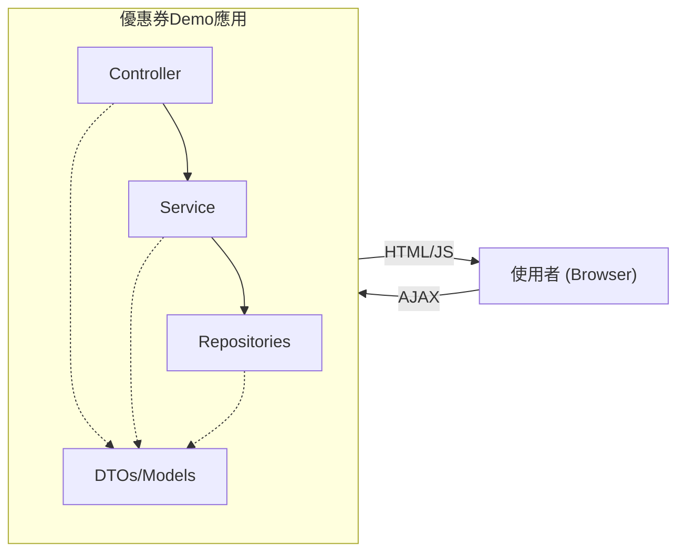
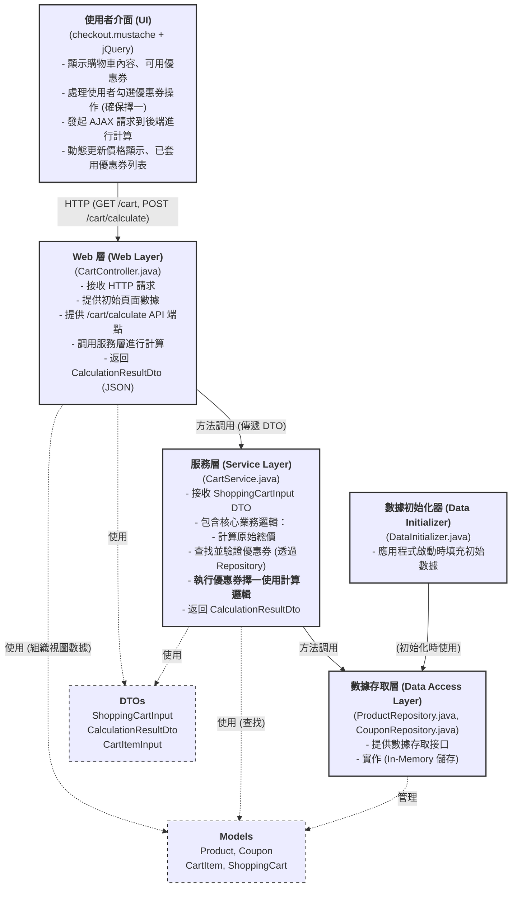

# 軟體架構文件：購物車功能

## 1. 引言與目標 (Introduction and Goals)

本章節描述了軟體架構師和開發團隊必須考慮的相關需求和驅動力，包括潛在的業務目標、系統的基本特性和功能需求、架構的品質目標以及相關利益關係人的期望。

### 1.1 文件目的與範疇
本文件旨在描述「電商優惠券」應用程式的軟體架構。它將闡述系統的各個組成部分、它們之間的關係、運行時行為以及關鍵的架構決策。本文件是理解此應用程式設計和實現的基礎，主要讀者為開發者、架構師及對此應用程式設計感興趣的相關人士。

### 1.2 需求概覽 (Requirements Overview)

#### 1.2.1 核心目標與驅動因素 (Core Goals and Driving Forces)

> **內容**: 此應用程式旨在清晰呈現特定業務邏輯下的計算結果，並闡明其設計。

此應用程式的核心目標是：
* **優惠券擇一使用邏輯呈現**：清晰地呈現當業務規則定義優惠券只能擇一使用時的計算結果與系統行為。
* **功能完整性**：提供一個可操作的購物車界面，允許用戶查看固定的商品、透過勾選選擇一張優惠券，並即時看到基於業務邏輯計算出的價格。
* **設計啟示**：幫助開發者理解在設計優惠券系統時，如何實現並強制執行優惠券的排他性使用規則。
* **技術實現**：一個使用特定技術棧（Java、Spring Boot、Mustache、jQuery、AJAX）實現的 Web 應用程式。

> **動機**: 從終端使用者的角度來看，此系統的建立旨在提供一個清晰的參考，說明標準電商情境下優惠券擇一使用的軟體行為，並輔助技術理解。

#### 1.2.2 主要功能需求 (Key Functional Requirements)

> **內容**: 系統需提供基本的購物車操作界面，並能根據選定的單張優惠券計算價格。

* 展示固定的購物車商品列表（包含 4 個預設產品）。
* 展示所有可用的固定金額優惠券列表（包含 4 個預設優惠券）。
* 允許使用者透過核取方塊勾選優惠券。
* 前端透過 AJAX 將選中的優惠券代碼（若有）發送到後端進行計算。
* 後端根據選中的優惠券計算折扣，返回計算結果 (原始總價、折扣後總價、總折扣、套用的優惠券列表)。
* 前端動態更新價格和已套用優惠券信息，並在發生錯誤時顯示適當的錯誤訊息。
* 允許使用者清除所有已選的優惠券。

> **形式**: 以上功能需求以條列方式呈現。詳細的互動場景請參見「4. 執行時期視圖」。

#### 1.2.3 品質目標 (Quality Goals)
* **響應性 (Responsiveness)**：前端操作（如勾選優惠券）後，價格更新應能快速響應，提供流暢的用戶體驗。
* **計算準確性 (依據特定邏輯)**：基於定義的特定業務邏輯，其數學計算必須是準確的。
* **可理解性 (Understandability)**：架構和程式碼應易於理解，以符合其設計說明和呈現的目的。

---

## 2. 系統脈絡與範疇 (Context and Scope)

本章節界定系統（即範疇）及其所有通訊夥伴（鄰近系統和使用者，即系統的脈絡）。它明確了外部介面，並區分業務脈絡和技術脈絡。

> **動機**: 領域介面和與通訊夥伴的技術介面是系統最關鍵的面向之一。完整理解這些介面至關重要。

### 2.1 業務脈絡
此應用程式處理電商購物車的結帳環節，其核心關注點在於優惠券的套用和計算。它並非一個完整的電商解決方案，而是專注於呈現特定優惠券邏輯的設計與實現。

### 2.2 技術脈絡
* **後端**: Java 21, Spring Boot 3.5.0, Spring MVC
* **前端模板引擎**: Mustache
* **前端腳本**: jQuery (用於 AJAX 和 DOM 操作)
* **數據儲存**: 應用程式內存 (In-memory ConcurrentHashMaps) 用於儲存產品和優惠券數據，無外部資料庫。
* **構建工具**: Gradle
* **開發工具**: Spring Boot DevTools (支援熱重載)

### 2.3 系統範疇與邊界

#### 2.3.1 系統脈絡圖 (System Context Diagram)

> **形式**: 下圖展示了系統與其主要外部互動者的關係。

* **使用者 (User)**：透過網頁瀏覽器與系統互動。
* **網頁瀏覽器 (Web Browser)**：執行 HTML、CSS 和 JavaScript (jQuery)，負責呈現使用者介面和發起 AJAX 請求。
* **電商優惠券應用 (Application Server)**：
    * 接收 HTTP 請求。
    * 提供初始 HTML 頁面。
    * 提供 API 端點 (`/cart/calculate`) 處理 AJAX 計算請求。
    * 執行業務邏輯（包括優惠券擇一使用的計算）。
    * 從內部數據存儲中讀取產品和優惠券信息。

#### 2.3.2 功能範疇 (Functional Scope)
**範圍內 (In Scope):**
詳細功能請參見 [1.2.2 主要功能需求](#122-主要功能需求-key-functional-requirements)。核心功能包括商品展示、優惠券選擇、價格計算（錯誤邏輯）、結果呈現。

**範圍外 (Out of Scope):**
* 使用者認證與授權。
* 完整的訂單生命週期管理（如下單、支付、配送）。
* 庫存管理。
* 複雜的優惠券規則（如有效期限、最低消費、特定商品適用、排他性規則的「正確」實現）。
* 使用者動態添加、移除或修改購物車中商品的功能（商品列表是固定的）。
* 購物車狀態的持久化儲存（例如，資料庫）。在此範例中，購物車的商品是固定的，優惠券狀態由前端管理並在每次計算時傳遞。
* 國際化與本地化。

---

## 3. 建構區塊視圖 (Building Block View)

本章節展示系統的靜態分解，將其拆解為建構區塊（模組、組件、類別等）及其依賴關係。這是理解原始碼結構的基礎。

> **動機**: 透過抽象化來理解原始碼結構，有助於維護系統概覽，並能在不揭露實作細節的情況下與利益關係人溝通。  
> **形式**: 此視圖為系統的白箱描述，包含其內部建構區塊的黑箱描述。

### 3.1 總體視圖與層次
以下圖表展示了系統的高層模組及其職責和關係。

### 3.2 組件職責
* **使用者介面 (UI)**：負責呈現資訊給使用者，並捕獲使用者輸入（勾選優惠券）。它使用 jQuery 透過 AJAX 與後端通訊，實現頁面的動態更新，避免整頁刷新。
* **Web 層 (`CartController`)**: 作為應用程式的入口點，處理來自前端的 HTTP 請求。它將請求路由到適當的服務，並將服務的結果轉換為適合前端的格式（HTML 頁面或 JSON 數據）。
* **服務層 (`CartService`)**: 封裝核心的業務邏輯。在此應用中，主要是根據輸入的商品和優惠券信息，執行價格計算。此服務設計為無狀態的。
* **數據存取層 (`ProductRepository`, `CouponRepository`)**: 抽象化數據的儲存和檢索。目前使用記憶體內存儲，但此層的設計允許未來更換為其他儲存機制（如資料庫）。
* **數據初始化器 (`DataInitializer`)**: 確保應用程式啟動時有可用的初始數據，方便系統運作。
* **DTOs**: 用於在 Web 層和服務層之間傳遞數據，實現層間解耦。
* **Models**: `Product` 和 `Coupon` 是核心領域模型。`CartItem` 和 `ShoppingCart` 主要由 `CartController` 用於組織數據以傳遞給 Mustache 模板進行初始頁面渲染。

---

## 4. 執行時期視圖 (Runtime View)

本章節以場景方式描述系統建構區塊在執行期間的具體行為和互動，涵蓋重要使用案例、關鍵外部介面互動、以及錯誤和例外場景。

> **動機**: 理解系統建構區塊（的實例）如何在執行時期執行其工作並進行通訊。這些場景有助於向較不熟悉靜態模型的利益關係人溝通架構。  
> **形式**: 場景以自然語言的編號步驟列表描述。

### 4.1 場景 1：使用者載入購物車頁面
1.  **使用者**: 在瀏覽器中輸入 URL (例如 `http://localhost:8080/cart`)。
2.  **瀏覽器**: 發送 `GET /cart` HTTP 請求到應用程式伺服器。
3.  **`CartController`**: `viewCartPage` 方法被調用。
    * 調用 `ProductRepository.findAll()` 獲取所有產品資訊。
    * 調用 `CouponRepository.findAll()` 獲取所有可用優惠券資訊。
    * 準備用於初始顯示的固定商品列表 (`initialFixedCartItemsForDisplay`)。
    * 將這些數據放入 `Model` 中。
4.  **Spring MVC**: 使用 `Model` 中的數據渲染 `checkout.mustache` 模板。
5.  **應用程式伺服器**: 將渲染後的 HTML 頁面返回給瀏覽器。
6.  **瀏覽器**: 顯示購物車頁面。
    * 頁面上的 jQuery 腳本在 `$(document).ready()` (或 `DOMContentLoaded`) 時執行。
    * 前端 JavaScript (`updateCartCalculation` 函數) 會立即發起一次 AJAX `POST /cart/calculate` 請求，傳遞固定的商品項目和空的優惠券列表，以獲取並顯示初始的（未打折的）總價。

### 4.2 場景 2：使用者勾選/取消勾選優惠券
1.  **使用者**: 在瀏覽器中勾選或取消勾選一個優惠券核取方塊。
2.  **瀏覽器 (jQuery)**:
    * `change` 事件被觸發。
    * JavaScript 確保 `currentAppliedCouponCodes` 列表最多只包含一個優惠券代碼。如果使用者勾選一個新的優惠券，之前已勾選的會被自動取消勾選。
    * 調用 `updateCartCalculation()` 函數。
3.  **瀏覽器 (jQuery - `updateCartCalculation` 函數)**:
    * 建構 `ShoppingCartInput` DTO，包含固定的商品項目列表 (`fixedCartItems`) 和更新後的 `currentAppliedCouponCodes` (最多一個元素，或為空)。
    * 發起 AJAX `POST /cart/calculate` 請求到應用程式伺服器，請求體為 JSON 格式的 `ShoppingCartInput` DTO。
    * 包含完整的錯誤處理邏輯，在發生錯誤時顯示適當的錯誤訊息。
4.  **`CartController`**: `calculateCart` 方法被調用。
    * `@RequestBody` 將 JSON 請求體反序列化為 `ShoppingCartInput` DTO。
    * 調用 `cartService.calculateTotalsFromDto(shoppingCartInput)`。
5.  **`CartService`**: `calculateTotalsFromDto` 方法執行：
    * 根據 `shoppingCartInput.items` 計算原始總價，包含產品存在性檢查。
    * 檢查 `shoppingCartInput.couponCodes`：
        * 如果列表為空或代碼無效，則不應用任何折扣。
        * 如果包含一個有效的優惠券代碼，則從 `CouponRepository` 獲取 `Coupon` 物件。
        * 記錄詳細的計算過程日誌。
        * **計算邏輯**：將此 **單張** 優惠券的 `discountAmount` 視為總折扣。
        * 將有效的 `Coupon` 物件加入到結果列表。
    * 計算折扣後總價，確保不會出現負數。
    * 返回一個包含計算結果的 `CalculationResultDto`。
6.  **`CartController`**: 將 `CalculationResultDto` 序列化為 JSON 並作為 HTTP 響應返回給前端。
7.  **瀏覽器 (jQuery - AJAX `success` 回調)**:
    * 接收到包含 `CalculationResultDto` 的 JSON 響應。
    * 調用 `renderCalculationResult(result)` 函數。
8.  **瀏覽器 (jQuery - `renderCalculationResult` 函數)**:
    * 使用返回的數據更新頁面上的相應元素（原始總價、折扣後總價、已套用優惠券列表、總節省金額等）。

---

## 5. 架構決策 (Architecture Decisions)

本章節記錄重要、昂貴、大規模或具風險的架構決策及其理由。這些決策是基於特定標準從不同方案中選擇的結果。

> **動機**: 系統的利益關係人應能理解和追溯這些架構決策。  
> **形式**: 以下列出重要的架構決策記錄 (Architecture Decision Records, ADRs)，採用簡化格式呈現，包含決策標題、內容（決策本身）及理由。

* **AD1: 技術棧選擇 (Java/Spring Boot, jQuery, Mustache)**
    * **決策**: 選用 Java + Spring Boot 作為後端，jQuery 處理前端 AJAX 和 DOM 操作，Mustache 作為模板引擎。
    * **理由**:
        * Spring Boot：快速開發，內嵌伺服器，簡化配置，適合本專案。
        * Java：廣泛使用，生態成熟。
        * jQuery：簡化前端 DOM 操作和 AJAX，對於此規模的項目足夠且易於理解。
        * Mustache：輕量級模板引擎，語法簡單，與 Spring Boot 整合良好。
    * **替代方案**:
        * 後端：Node.js/Express, Python/Flask (更輕量，但 Java/Spring Boot 更能體現企業級場景的簡化版)。
        * 前端：原生 JavaScript, Vue.js, React (對於此規模可能過於複雜，jQuery 更直接)。
* **AD2: 無狀態服務層 (`CartService`)**
    * **決策**: `CartService` 設計為無狀態，其計算方法 (`calculateTotalsFromDto`) 的輸出僅依賴於其輸入參數 (`ShoppingCartInput`)。
    * **理由**:
        * 簡化服務邏輯，易於理解和測試。
        * 符合現代 API 設計趨勢，易於擴展（如果需要）。
        * 計算邏輯與狀態管理分離。
    * **替代方案**: 有狀態的服務層，服務內部持有購物車狀態（類似早期版本）。對於此設計目標，無狀態更清晰。
* **AD3: 前端管理購物車狀態 (優惠券選擇)**
    * **決策**: 購物車中的商品項目是固定的。已選擇的優惠券列表狀態由前端 JavaScript 維護，並在每次計算請求時透過 AJAX 發送給後端。
    * **理由**:
        * 實現類似 SPA 的即時反饋體驗，避免整頁刷新。
        * 簡化後端，後端不需要管理使用者會話中的購物車狀態（對於優惠券部分）。
    * **替代方案**: 完全由後端 Session 管理購物車狀態。對於 AJAX 和前後端分離的計算，前端管理更合適。
* **AD4: 固定商品列表**
    * **決策**: 購物車中的商品項目在應用程式啟動時固定，使用者不能修改。
    * **理由**: 簡化範圍，使核心焦點集中在優惠券的計算邏輯上，避免實現完整的商品管理和購物車操作功能。
    * **替代方案**: 允許使用者動態添加/修改購物車商品。會增加專案複雜度，偏離核心設計目標。
* **AD5: 記憶體內數據存儲 (`In-Memory Repositories`)**
    * **決策**: 產品和優惠券數據使用 `ConcurrentHashMap` 存儲在應用程式記憶體中。
    * **理由**:
        * 對於本專案足夠，啟動快速，無需外部資料庫配置。
        * 易於透過 `DataInitializer` 填充初始數據。
    * **替代方案**: 使用 H2 內存資料庫或外部資料庫。會增加配置複雜性。
* **AD6: 優惠券排他性使用策略**
    * **決策**: 系統設計為優惠券只能擇一使用。使用者在一次交易中只能選擇並套用一張優惠券。如果使用者嘗試選擇第二張優惠券，系統將自動取消第一張優惠券的選擇，或提示使用者進行選擇。
    * **理由**:
        * **符合常見業務實踐**: 大多數電商平台的優惠券（尤其是固定金額折扣券）設計為不可疊加使用，以控制促銷成本和避免過度折扣。
        * **避免潛在財務風險**: 無限制的優惠券疊加可能導致商品價格遠低於成本，甚至出現負價格，造成財務損失。
        * **簡化折扣邏輯**: 擇一使用大大簡化了後端計算折扣的複雜性，也使前端用戶體驗更清晰，避免了複雜組合的困惑。
        * **使用者預期**: 使用者通常預期優惠券是擇優使用，而非全部疊加。
    * **替代方案**:
        * **允許多張優惠券疊加**: 即專案之前的設計。這會增加計算的複雜性，並可能不符合標準業務需求，且具有潛在的財務風險。
        * **有條件的疊加**: 例如，允許特定類型的優惠券（如運費券和商品折扣券）疊加，或達到一定消費門檻後允許疊加。這會增加業務規則和系統實現的複雜度，對於此專案的核心目標而言不是必需的。
* **AD7: DTO 用於服務層接口**
    * **決策**: `CartService` 的公共計算接口接收 `ShoppingCartInput` DTO 並返回 `CalculationResultDto`。
    * **理由**:
        * 明確服務層的數據契約。
        * 使服務層不直接依賴於 Web 層的請求細節或領域模型的內部表示（儘管在此例中 DTO 與模型結構相似）。
        * 方便 API 的測試和演進。
    * **替代方案**: 服務層直接接收 HttpServletRequest 或多個原始參數。DTO 更結構化。

---

## 6. 詞彙表 (Glossary)

本章節定義了利益關係人在討論系統時使用的最重要的領域和技術術語。

> **動機**: 清晰定義術語，確保所有利益關係人對這些術語有相同的理解，避免使用同義詞和同形異義詞。  
> **形式**: 術語及其定義以下表形式呈現。

| 詞彙 (Term)                      | 定義 (Definition)                                                                                                |
|----------------------------------|--------------------------------------------------------------------------------------------------------------------|
| AJAX (Asynchronous JavaScript and XML) | 一種在無需重新載入整個網頁的情況下，能夠更新部分網頁的技術。此專案中用於前端與後端計算 API 的非同步通訊。                         |
| API 端點 (API Endpoint)        | 後端提供服務的特定 URL，前端可以透過此 URL 發起請求以獲取數據或執行操作 (例如 `/cart/calculate`)。                                |
| Controller (控制器)              | 在 MVC (Model-View-Controller) 架構中，負責接收使用者輸入、調用模型和服務進行處理，並選擇適當的視圖來呈現結果的組件。在此專案中為 `CartController`。 |
| DTO (Data Transfer Object - 數據傳輸物件) | 一個簡單的物件，用於在應用程式的不同層之間（例如 Controller 和 Service 之間）傳輸數據。例如 `ShoppingCartInput`, `CalculationResultDto`。 |
| DOM (Document Object Model - 文件物件模型) | 一個程式設計接口，用於 HTML 和 XML 文件。它將文件表示為一個由節點和物件組成的樹狀結構，允許程式和腳本動態地存取和更新文件的內容、結構和樣式。 |
| Gradle                           | 一個基於 Apache Ant 和 Apache Maven 概念的開源構建自動化系統。                                                               |
| In-Memory Storage (記憶體內存儲)   | 將數據直接存儲在應用程式的運行記憶體中，而不是外部持久化儲存（如資料庫）。應用程式關閉後數據會丟失。                                       |
| jQuery                           | 一個快速、小巧且功能豐富的 JavaScript 函式庫。它使 HTML 文件遍歷和操作、事件處理、動畫和 Ajax 等操作簡單得多。                             |
| JSON (JavaScript Object Notation)  | 一種輕量級的數據交換格式，易於人閱讀和編寫，也易於機器解析和生成。                                                                 |
| Model (模型)                     | 在 MVC 架構中，代表應用程式的數據和業務邏輯。在此專案中，如 `Product`, `Coupon`, `ShoppingCart` 等類別。                               |
| Mustache                         | 一種無邏輯 (logic-less) 的模板引擎，可用於 HTML、配置文件、原始碼等。                                                              |
| Repository (倉儲)                | 一種設計模式，用於抽象化數據的存取。提供一個類似集合的接口來存取領域物件。例如 `ProductRepository`, `CouponRepository`。                     |
| Service Layer (服務層)           | 封裝應用程式核心業務邏輯的層次。例如 `CartService`。                                                                         |
| Stateless (無狀態)               | 指服務或組件不保存先前與客戶端互動的任何信息（狀態）。每個請求都被視為獨立的事務。                                                       |
| UI (User Interface - 使用者介面)   | 使用者與應用程式互動的視覺部分。在此專案中為 `checkout.mustache` 渲染的 HTML 頁面。                                                     |
| 錯誤處理 (Error Handling)        | 系統在各層級（前端 JavaScript、後端 Controller、Service）都實現了完整的錯誤處理機制，包括：前端 AJAX 請求的錯誤處理和用戶反饋、後端服務層的產品和優惠券存在性檢查、詳細的計算過程日誌記錄。 |